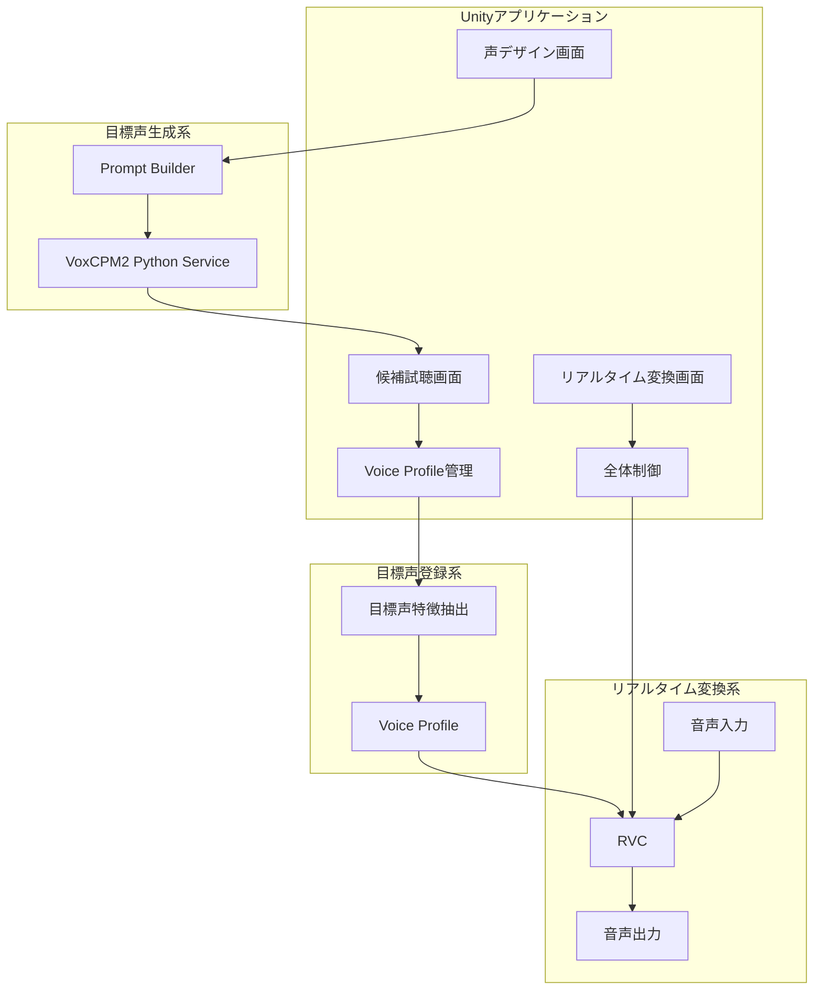
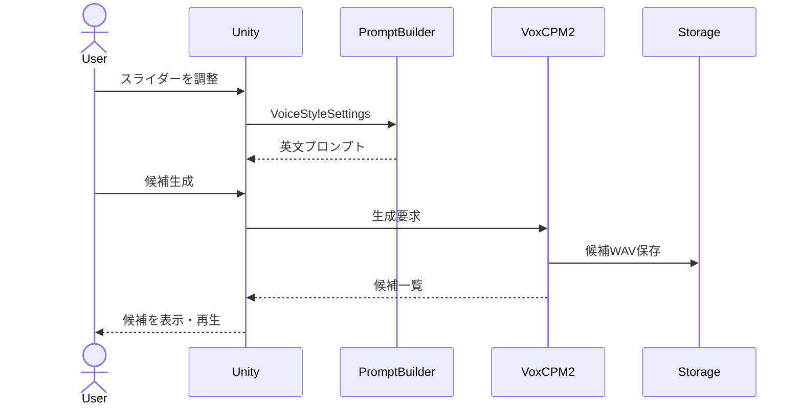

# VCBM

**V**oice **C**hanger **B**ench **M**ark

## 概要

VoxCPMをUnityから操作するデモプロジェクトです。

Python仮想環境上でVoxCPMのローカルHTTPサーバーを起動し、
UnityからHTTP APIを通じて音声生成の要求や生成結果の取得を行います。

ここでの目的は、ユーザーが指定した声質を持つ
```参照音声.wav```を生成することです。  
生成処理はリアルタイムである必要はなく、
処理速度よりも、生成音声の自然さ、声質の再現性、および調整のしやすさを優先します。

現段階での構想については、本ドキュメントの下部に記載しています。

## 環境

### 開発環境

| | 要求（バージョン等） |
|:-:|:-:|
| Unity | 6000.5.5f1 |
| Python | ≥ 3.10 (<3.13) |
| CUDA | ≥ 12.0 |

### 動作実証環境

|||
|:-:|:-:|
| OS | Windows 11 Home |
| CPU | 13th Gen Intel(R) Core(TM) i7-13700F (2.10 GHz) |
| 実装RAM | 32.0 GB |
| グラフィックスボード | NVIDIA GeForce RTX 4070 (12 GB) |
| CUDA | 12.4 |

## 環境構築

## Unityプロジェクト

### 本Unityプロジェクトのクローン

任意のディレクトリで作業を行います。

```bash git clone
git clone https://github.com/Yupopyoi/VCBM.git
```

## [VoxCPM](https://github.com/OpenBMB/VoxCPM/)

### VoxCPMのクローン

**Toolsディレクトリ内（VCBM\Tools\）** で作業を行います。

> [!NOTE]
> Toolsディレクトリでgit cloneした場合、VocCPMのリポジトリがgitignoreされます。

下記のコマンドを実行し、VocCPMのリポジトリをクローンします。

```bash:git clone
cd VCBM/Tools
git clone https://github.com/OpenBMB/VoxCPM.git VoxCPM
```

### python仮想環境を作成する

```bash:venv
cd .\VoxCPM
py --version
```

```Python 3.12.x```のように、**≥ 3.10 (<3.13) の範囲**でのバージョン表示がされればOKです。

仮想環境を作成します。3.12の部分はインストールされているpythonバージョン名を記入してください。
その後、仮想環境を有効化します。

```bash:venv
py -3.12 -m venv .venv
.\.venv\Scripts\Activate.ps1
```

(.venv)が表示されたら、必要なPythonツールを更新します。

```bash:install
python -m pip install --upgrade pip setuptools wheel python-multipart `
  "fastapi>=0.115,<1" `
  "uvicorn>=0.30,<1" `
  "pydantic>=2.8,<3"
```

### VocCPMを仮想環境にインストールする

VocCPMを仮想環境にインストールします。それなりに時間がかかります。

```bash:install_voc_cpm
python -m pip install -e .
```

その後、下記のコマンドを実行し、インストールが正常終了したことを確認します。

```bash:check_install
python -c "import fastapi, uvicorn, pydantic; from voxcpm import VoxCPM; print('VoxCPM import OK')"
```

### CUDA版PyTorchをインストール（オプション）

**TVoxCPMディレクトリ内（VCBM\Tools\VoxCPM）** で作業を続けます。

```bash:install_pytorch
$Py = ".\.venv\Scripts\python.exe"

& $Py -m pip install --no-cache-dir`
  torch==2.5.1 `
  torchvision==0.20.1 `
  torchaudio==2.5.1 `
  --index-url https://download.pytorch.org/whl/cu124

& $Py -c "import torch; print('torch:', torch.__version__); print('built CUDA:', torch.version.cuda); print('available:', torch.cuda.is_available()); print('GPU:', torch.cuda.get_device_name(0) if torch.cuda.is_available() else 'None')"
```

### ローカルHTTPサーバーの確立

Toolsディレクトリ内にある ```build_server.bat``` をダブルクリックします。  

## Unity実行

### 実行

UnityHubを開きます。Projects内のAddより、```Add project from disk``` を選択します。  
git cloneしてきたUnityプロジェクトを選択してOpenします。

Unityプロジェクトを開いたのち、Projectビュー内、Assets/ScenesからVoiceDesignシーンをダブルクリックします。  
その後、画面上部の「再生ボタン」をクリックします。

### HTTP APIの動作確認

画面右下部の ```Check Service``` をクリックします。

UnityのConsoleビューにエラーが出ておらず、

> [VoxCPM2] Service OK / model: not_loaded / device: auto

のように出力されていればOKです。  
また、コマンドプロンプト上に、```"GET /health HTTP/1.1" 200 OK```と表示されていることを確認します。

### プロンプト作成

設定可能項目は以下の通りです。これらの項目によってプロンプトを作成することができます。

| 設定可能項目 | 説明 |
|:-:|:-:|
| Youthful | 目標とする声の若さ |
| Pitch | 声の高さ |
| Brightness | 声の明るさ |
| Softness | 声の柔らかさ |
| Breathiness | 息の入り具合 |
| Energy | 声のエネルギー |
| Cuteness | 声のかわいさ |
| Expressiveness | 声の表現力 |
| Speed | 発音のスピード |
| Naturalness | 声の自然さ |

> [!NOTE]
> スライダーを操作して値を0にすると、当該項目によるプロンプトを削除できます。

また、プロンプトに任意の指示を付け加えたい場合、```Additional English Instruction``` に記載します。

> [!TIP]
> 全てのスライダーの値を0にすると、完全に任意のプロンプトを用いたボイス生成を指示することができます。  

### ボイス生成

Test speechに任意の文章を入れます。~~UIが適当なので文章を入れにくいです~~。  
ある程度長い文章（目安は２行）の方がうまくいく気がします。  

その後、画面下部の ```Generate Voice``` をクリックします。

> [!NOTE]
> 初回実行時はモデル（VoxCPM2）の読み込みが行われるため、時間がかかります。

設定可能項目は以下の通りです。

| 設定可能項目 | 説明 |
|:-:|:-:|
| CFG | 声の指示や参照音声へ、どれくらい強く従わせるかを決める値です。 <br> 値が大きいほどプロンプトに強く従うようになりますが、不自然さの原因になります。<br> 公式UI上の範囲が1.0～3.0、標準値が2.0です。|
| Steps | ステップ数 |
| Seed | 乱数のシード値（シード値によって出力は大きく変化します。いろいろ試すと良いです。） |
| Candidates | 出力する音声候補数（1-3） |

> [!TIP]
> 生成の進み具合はコマンドプロンプトから確認できます。  
> いずれはUnityのゲームビューから見られるようにしたいですね。

### ボイス再生

画面下部に現れる ```Play``` ボタンを押すことで音声を再生することができます。  
生成したボイスは、```Tools\VoxCPMService\output``` に保存されています。

### 参考プロンプト

```txt:ex1
A Japanese young adult woman speaking in a relaxed everyday conversation. Her voice stays in a comfortable, naturally light register. Her vocal tone is light, clear and warm, with a gentle smile and soft, rounded vocal resonance. The voice remains clean and focused without excessive breathiness. She sounds naturally charming and friendly, with relaxed but attentive energy. She uses subtle, varied intonation and small spontaneous changes in rhythm. She speaks at a natural conversational pace. The performance is realistic, human and conversational, without forced pitch, exaggerated acting, squeaking or cartoon-like delivery.
```

## [RVC](https://github.com/RVC-Project/Retrieval-based-Voice-Conversion-WebUI/blob/main/docs/jp/README.ja.md)

Unityとは未連携です。

### RVCのクローン

**Toolsディレクトリ内（VCBM\Tools\）** で作業を行います。

> [!NOTE]
> Toolsディレクトリでgit cloneした場合、RVCのリポジトリがgitignoreされます。

下記のコマンドを実行し、RVCのリポジトリをクローンします。

```bash:git clone
cd VCBM/Tools
git clone https://github.com/RVC-Project/Retrieval-based-Voice-Conversion-WebUI.git
```

---

### RVC用のpython仮想環境を作成する

```bash:venv
cd Retrieval-based-Voice-Conversion-WebUI
py -3.12 -m venv .venv
.\.venv\Scripts\activate
python -m pip install --upgrade pip setuptools wheel
```

NVIDIA **RTX50系**のGPUを使用している場合は次のコマンドを実行してください。

```bash:get_requirements
python -m pip install torch==2.7.1+cu128 torchaudio==2.7.1+cu128 `
  --index-url https://download.pytorch.org/whl/cu128 `
  --extra-index-url https://pypi.org/simple
python -m pip install -r requirments_cu128_py312.txt
python -c "import torch; print('torch:', torch.__version__); print('cuda:', torch.version.cuda); print('cuda available:', torch.cuda.is_available())"
```

NVIDIA **RTX50系以前**のGPUを使用している場合は次のコマンドを実行してください。

```bash:get_requirements
python -m pip install torch==2.7.1+cu118 torchaudio==2.7.1+cu118 `
  --index-url https://download.pytorch.org/whl/cu118 `
  --extra-index-url https://pypi.org/simple
python -m pip install -r requirments_cu118_py312.txt
python -m pip install --no-cache-dir --force-reinstall "numpy==1.26.4" "faiss-cpu>=1.13.0,<2"
python -c "import torch; print('torch:', torch.__version__); print('cuda:', torch.version.cuda); print('cuda available:', torch.cuda.is_available())"
```

---

### モデルのダウンロード

```bash:download_model
python -m pip install --upgrade huggingface_hub

# Required for inference and feature extraction
hf download lj1995/VoiceConversionWebUI --revision main `
  --include "hubert_base/*" --local-dir assets
hf download lj1995/VoiceConversionWebUI rmvpe.pt --revision main `
  --local-dir assets/rmvpe

# Required for v1/v2 training
hf download lj1995/VoiceConversionWebUI --revision main `
  --include "pretrained/*" "pretrained_v2/*" --local-dir assets
hf download lj1995/VoiceConversionWebUI mute.zip --revision main `
  --local-dir .model-downloads
python -m zipfile -e .model-downloads/mute.zip logs

# Required only for pymss/MSST vocal separation
hf download lj1995/VoiceConversionWebUI --revision main `
  --include "pymss_weights/*" --local-dir assets

python -m pip install --force-reinstall "huggingface-hub>=0.26.0,<1.0"
```

---

### webui.pyの実行

```bash:exec_webui
$env:PYTHONSAFEPATH = "1"
$env:PYTHONPATH = (Get-Location).Path
$env:PYTHONNOUSERSITE = "1"

.\.venv\Scripts\python.exe webui.py
```

---

### webuiによるトレーニング

- [ローカルホスト（ポート番号7865）](http://localhost:7865/) にアクセスする
- 上部のタブから「トレーニング」を選択
- ステップ１
  - 「モデル名」に任意の名前を入れる
  - 目標サンプリングレートは40kとする（48kでも良いが、この先は40kであることを前提として進める）
  - 「音高ガイド」はtrueにする
  - 「CPUスレッド数」は既定（16）
  - 「トレーニング用フォルダのパス」には、wavファイルが保存されているフォルダのパスを指定する
  - 「話者ID」は既定（0）
  - 「データ処理」をクリックする
- ステップ２
  - 「特徴抽出」をクリックする
- ステップ３
  - 各トレーニング設定を変更する（変更しなくてもOK）
  - 事前学習済みのモデルを入手する
    - [HuggingFace](https://huggingface.co/lj1995/VoiceConversionWebUI/tree/main/pretrained_v2)より、f0D40kとf0G40kをダウンロードする
    - ダウンロードしたモデルを、```Retrieval-based-Voice-Conversion-WebUI\assets\pretrained_v2```に入れる
  - UIにおける「事前学習済みのG/Dモデルのパス」に、```assets/pretrained_v2/f0G40k.pth```、```assets/pretrained_v2/f0D40k.pth```と記載する
  - 「モデルのトレーニング」をクリックする。
  - ```Retrieval-based-Voice-Conversion-WebUI\assets\weights```に、学習済もモデルが保存されていることを確認する

---

### webuiによる音声変換

- [ローカルホスト（ポート番号7865）](http://localhost:7865/) にアクセスする
- 上部のタブから「モデル推論」を選択
- 「音源推論」から、先ほど作成したpthファイルを選択する
- 「話者ID」は既定（0）
- １つのwavファイルだけ変換する場合は「単発推論」を、任意のフォルダ内の全てのwavファイルを変換する場合は「一括推論」を選択する
- ピッチ変更は、男声→女声の場合、+6前後が目安
- その他の項目は任意に選択し、「変換」をクリックする

---

## Unity Sentis環境構築

Unityで次を開きます。

```bash:install_sentis
上部Windowタブ
  → Package Manager
  → Package Management
  → 左上の「＋」
  → Install package by technical name
  → com.unity.ai.inference と入力して、Install
```


## システムの持つ機能（構想）

本システムは、次の二つの機能を有する。

1. **目標声の生成**
   - Unityでユーザーが声の特徴を設定する。
   - UnityがVoxCPM2用の英文プロンプトを生成する。
   - VoxCPM2が複数の候補音声を生成する。
   - ユーザーが候補を試聴し、使用する声を選択する。

2. **リアルタイム音声変換**
   - 選択した目標音声から目標話者特徴を抽出する。
   - RVCがマイク入力を目標声へ変換する。
   - 発話内容、発話タイミング、語尾、抑揚を可能な範囲で保持する。

## 機能関連図（構想）



## 主要シーケンス（構想）

### 声候補生成


