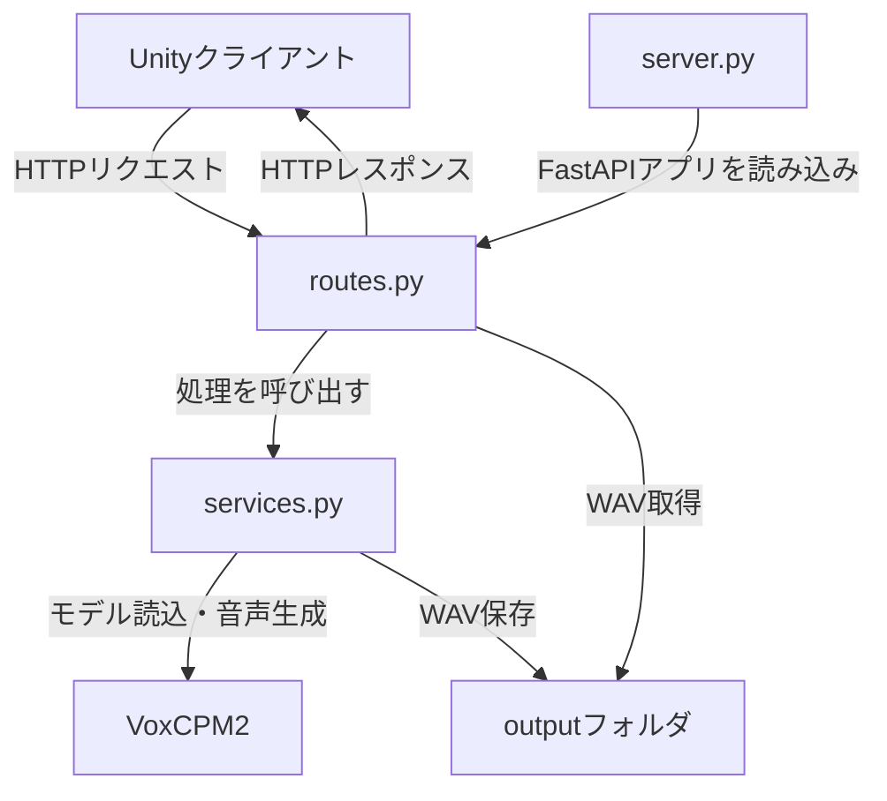
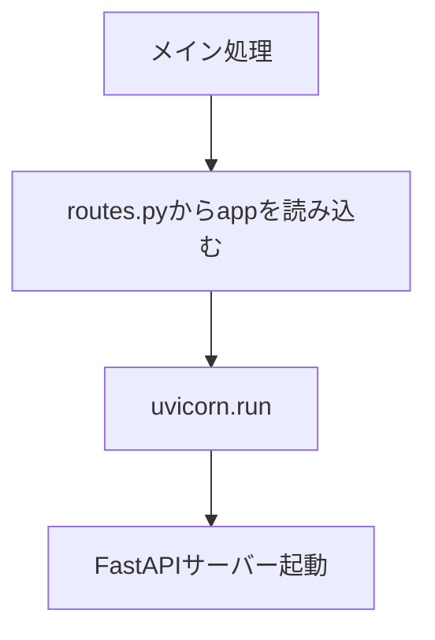
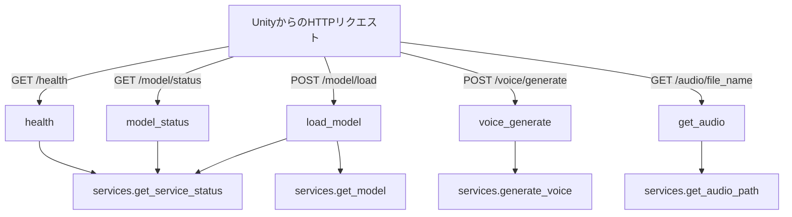
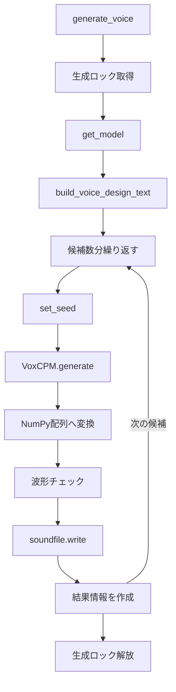
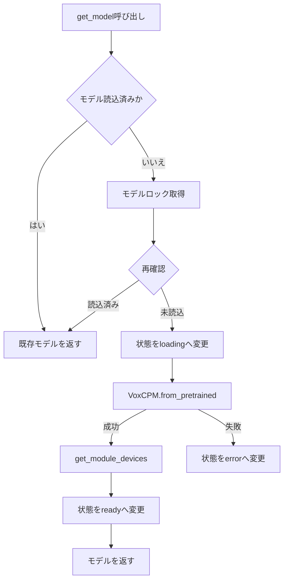
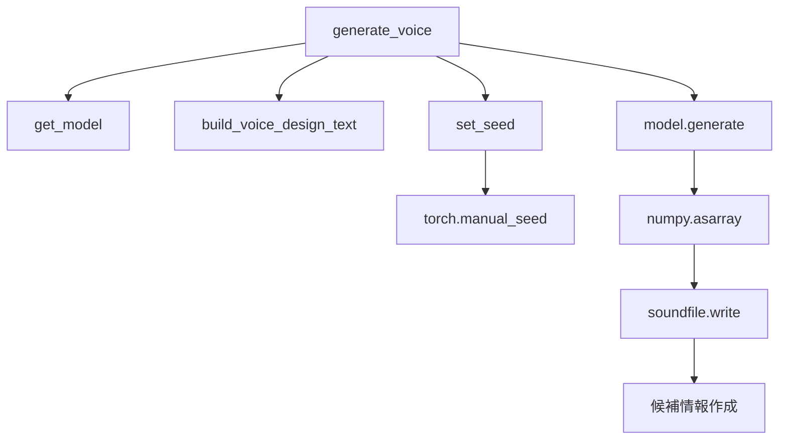
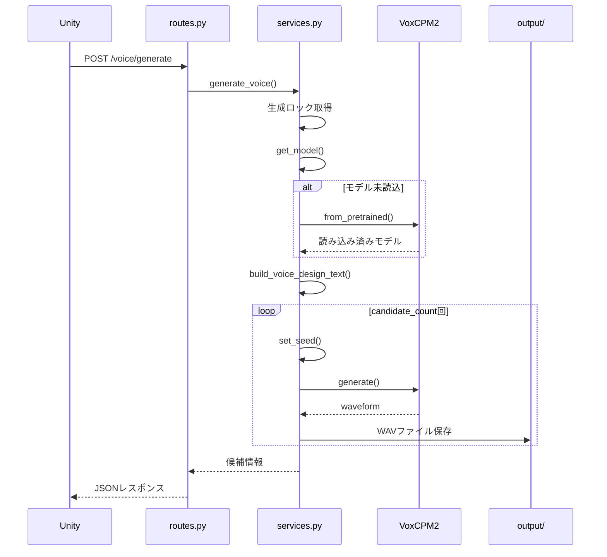
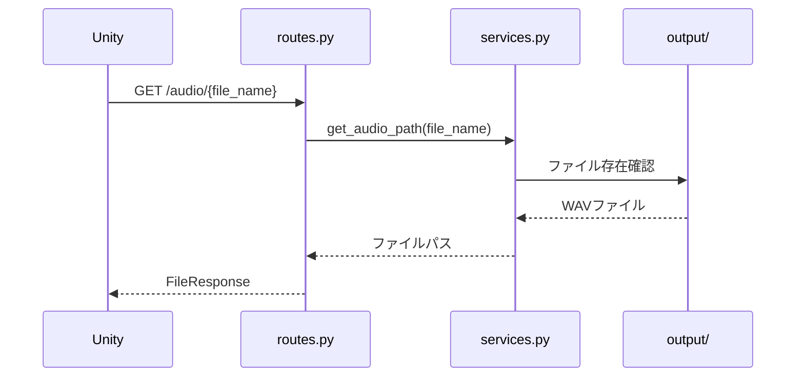

# VCBM VoxCPM2 Local Service

## ユニット（関数）構造図

## 1. 全体構成



---

## 2. ファイル別構造

```text
server.py
└─ メイン処理
   └─ uvicorn.run()
      └─ routes.py の app を起動

routes.py
├─ GenerateRequest
│
│  サーバー、モデル、CUDAの状態を返す。（GET /health）
├─ health()
│
│  VoxCPM2モデルの読み込み状態を返す。（GET /model/status）
├─ model_status()
│
│  VoxCPM2モデルを明示的に読み込む。（POST /model/load）
├─ load_model()
│
│  Voice Designによる音声生成を実行する。（POST /voice/generate）
├─ voice_generate()
│
│  outputフォルダ内のWAVを参照して、同じ声質の音声を生成する。（POST /voice/clone）
├─ voice_clone()
│
│  生成済みWAVファイルを返す。（GET /audio/{file_name}） 
└─ get_audio()

services.py
├─ GenerationBusyError
├─ set_seed()
├─ get_module_devices()
├─ build_voice_design_text()
├─ build_clone_text()
├─ get_model()
├─ get_service_status()
├─ generate_voice()
│  ├─ get_model()
│  ├─ build_voice_design_text()
│  ├─ set_seed()
│  ├─ VoxCPM.generate()
│  └─ soundfile.write()
│
└─ get_audio_path()
```

---

## 3. `server.py` の構造



### ユニット一覧

| ユニット            | 処理内容                 |
| --------------- | -------------------- |
| メイン処理           | Pythonから直接実行されたか確認する |
| `uvicorn.run()` | FastAPIサーバーを起動する     |

### 呼び出し関係

```text
メイン処理
└─ uvicorn.run(
       app=routes.app,
       host="127.0.0.1",
       port=8765
   )
```

---

## 4. `routes.py` の構造



### HTTP受付ユニット

| 関数                 | HTTPメソッド | URL                  | 呼び出す処理                 |
| ------------------ | -------- | -------------------- | ---------------------- |
| `health()`         | GET      | `/health`            | `get_service_status()` |
| `model_status()`   | GET      | `/model/status`      | `get_service_status()` |
| `load_model()`     | POST     | `/model/load`        | `get_model()`          |
| `voice_generate()` | POST     | `/voice/generate`    | `generate_voice()`     |
| `get_audio()`      | GET      | `/audio/{file_name}` | `get_audio_path()`     |

### `GenerateRequest`

音声生成APIで受け付けるデータを定義する。

```text
GenerateRequest
├─ voice_prompt
├─ speech_text
├─ cfg_value
├─ inference_timesteps
├─ seed
├─ candidate_count
└─ normalize
```

---

## 5. `services.py` の構造



---

## 6. モデル管理ユニット



### `get_model()`

```text
get_model()
├─ モデルがすでに存在する
│  └─ 既存モデルを返す
│
└─ モデルが存在しない
   ├─ モデル読み込みロックを取得
   ├─ 状態を loading に設定
   ├─ VoxCPM.from_pretrained() を実行
   ├─ get_module_devices() で配置先を取得
   ├─ 状態を ready に設定
   └─ モデルを返す
```

---

## 7. 音声生成ユニット

### `generate_voice()`

```text
generate_voice()
├─ 生成ロック取得
│
├─ get_model()
│  └─ VoxCPM2モデルを取得
│
├─ build_voice_design_text()
│  └─ 音声プロンプトと発話文章を結合
│
├─ 候補数分繰り返す
│  ├─ set_seed()
│  ├─ model.generate()
│  ├─ NumPy配列へ変換
│  ├─ 空の波形でないか確認
│  ├─ ファイル名を作成
│  ├─ sf.write()
│  └─ 候補情報をリストへ追加
│
├─ 生成結果を返す
│
└─ 生成ロック解放
```

### 詳細な呼び出し関係



---

## 8. 補助ユニット

### `set_seed()`

乱数シードを統一し、同じシードで近い生成結果を再現できるようにする。

```text
set_seed()
├─ random.seed()
├─ numpy.random.seed()
├─ torch.manual_seed()
└─ torch.cuda.manual_seed_all()
```

### `get_module_devices()`

モデルのパラメータとバッファが配置されているデバイスを取得する。

```text
get_module_devices()
├─ module.parameters()
├─ module.buffers()
└─ デバイス一覧を返す
```

戻り値の例：

```text
["cuda:0"]
```

または、

```text
["cpu"]
```

### `build_voice_design_text()`

音声設計プロンプトと発話文章を、VoxCPM2用の形式に変換する。

```text
入力
├─ voice_prompt
└─ speech_text

処理結果
└─ (voice_prompt)speech_text
```

例：

```text
voice_prompt:
A young Japanese girl with a bright and youthful voice.

speech_text:
今日はいい天気だね。
```

変換結果：

```text
(A young Japanese girl with a bright and youthful voice.)今日はいい天気だね。
```

### `get_service_status()`

モデルとGPUの状態を取得する。

```text
get_service_status()
├─ モデル状態
├─ モデルID
├─ 指定デバイス
├─ 実際のモデル配置先
├─ PyTorchバージョン
├─ CUDAバージョン
├─ CUDA利用可否
├─ GPU名
├─ GPUメモリ使用量
└─ エラー内容
```

### `get_audio_path()`

指定されたWAVファイルを安全に取得する。

```text
get_audio_path()
├─ ファイル名だけであることを確認
├─ outputフォルダ内のパスを作成
├─ ファイル存在確認
└─ Pathを返す
```

---

## 9. 音声生成時のシーケンス



---

## 10. 音声ファイル取得時のシーケンス


